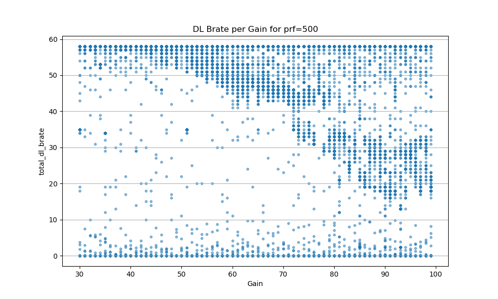

# Overview

This is a repo dedicated to OTA (Over the Air) processing of 5G signals against FM (Frequency Modulated) Pulsed Radar signals. 

# Setup


## Operations
The flow for the data can be see in the OTAexpCTL.py file. And the “runLoop1” is called from main. The flow for each run is as follows:
Turn everything off. << or assume they are.
Start the gnb.
Turn air plane mode off on the android phone.
Wait for ue to attach. << validate w/ ping.
Leave ping running in background.
Start iperf server on UE.
Start iperf throughput run . DL test at ~60Mbps.
Start radar for 20s.
Iperf /throughput on the system should be effected.
After 20s stop radar.
Stop iperf test.
Airplane mode ue
Stop gnb.
Collect logs. From /tmp/gnb.
Process logs into respective .csv files.
Increment radar parameters.
Run again.
 
This whole thing takes about 30-40s each. And we do about 1-2k times. So about a day or 2. Some are about 800mins.
We don’t save the /tmp/gnb.log files because each run these are about 50-100Mb and at 1-2k runs this is a lot. Last time I left them it was about 120Gb. I need a NAS I guess soon. I have an old computer tower I’ll prob get some 1TB HDDs or something soon, either that or I need a server at stevens to hold things, or at least to back things up for science.

## Logs
Take a look at the processed logs:
```processed_logs_20250804/20250804_100355_ULMeas.csv
processed_logs_20250804/20250804_100355_iperf.csv
processed_logs_20250804/20250804_100355_metrics.csv
processed_logs_20250804/20250804_100355_phy_pucch.csv
processed_logs_20250804/20250804_100355_radar_config.csv
```
 
radar_config.csv is the radar parameters. This is the variable in the experiment. We change either the PRF, the Center frequency, or a few other things to see the influence on the gnb.
 
Iperf.csv this is the data from the iperf3 run that we start. This is set to hit the UE at about 60Mbps which is slightly higher than expected for a 20MHz serving cell. 
 
Metrics.csv these are done ever 1s (1000ms) and are pretty interesting. They show the similar throughput to the iperf test w/ more information about link adapation (MCS) and other things. << pretty “slow” though for logs and information.
 
ULMeas.csv << these are UL Measurement Reports. These are similar to UE UL reports about the DL quality done during a HO. Instead there is no HO (Handover) so I am forcing the UE to report the serving sell statisitics. These can be done as quickly as 120ms. This is the DL RSRP/RSRQ/SINR.
 
Phy_pucch.csv thse are the files that are found from the UE on the PUCCH. These estimate the PUCCH data. This also includes the CSI (Channel State Information) this can be as quick as every 10ms. There are also other metrics collected every 5ms. This is certainly what is filling up the logs.


# Invesitgations
Here are some side investigations that are on going. 

## Finding GAIN interference values. 
We want to find where the GAIN has the most impact. TOO low, and the 5G signal will be unaffected. too high, and we might be oversaturating the whole input and there are no loger any interference values to look at. 

### processed_logs_20250803-1
Here we ran w/ the PRF locked to 3000, and the radar gain set from 30 to 100 in 1 step increments. We ran this experiment 3x . 


from this file we can see that at about 40 gain there begins to be an impact and after about 85 there is no more impact from increasing the gain. VERY COOL!. 

### processed_logs_20250804
gain from 30-100, stp=1. PRF = 500
