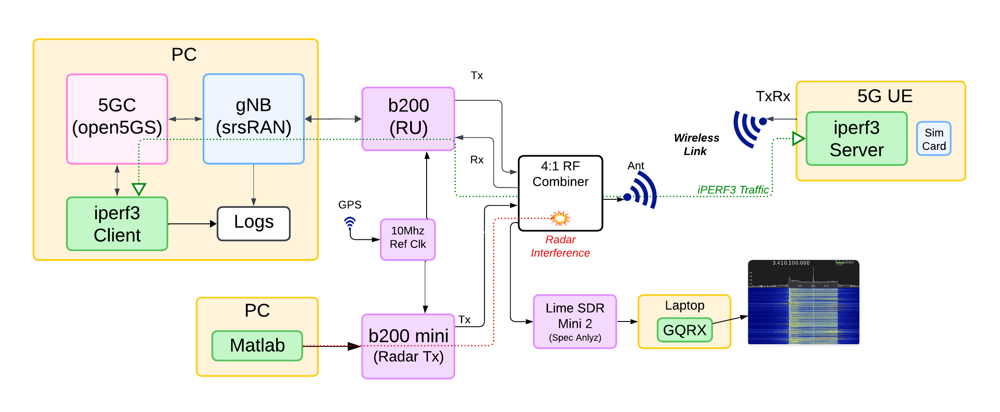
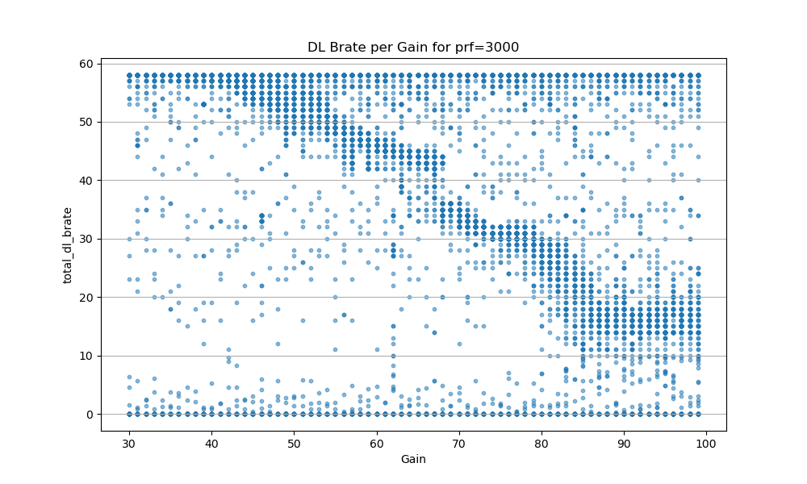

# Overview

This is a repo dedicated to OTA (Over the Air) processing of 5G signals against FM (Frequency Modulated) Pulsed Radar signals. 

# Setup

# Invesitgations
Here are some side investigations that are on going. 

## Finding GAIN interference values. 
We want to find where the GAIN has the most impact. TOO low, and the 5G signal will be unaffected. too high, and we might be oversaturating the whole input and there are no loger any interference values to look at. 

### processed_logs_20250803-1
Here we ran w/ the PRF locked to 3000, and the radar gain set from 30 to 100 in 1 step increments. We ran this experiment 3x . 

from this file we can see that at about 40 gain there begins to be an impact and after about 85 there is no more impact from increasing the gain. VERY COOL!. 
