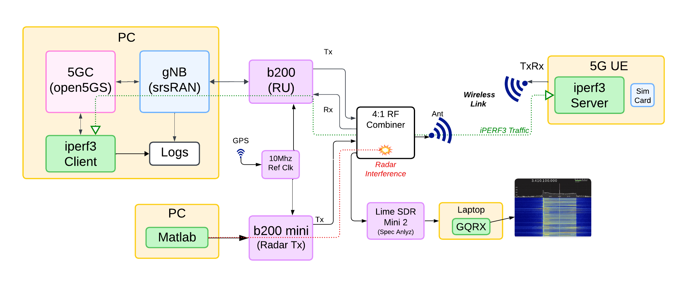
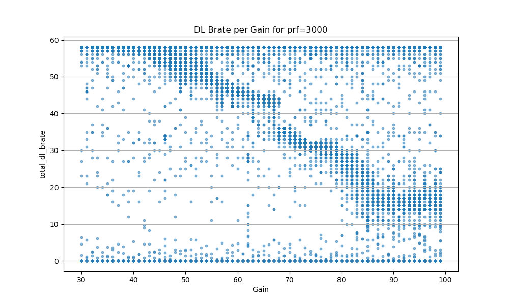
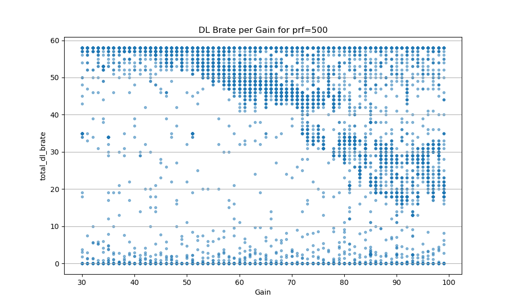
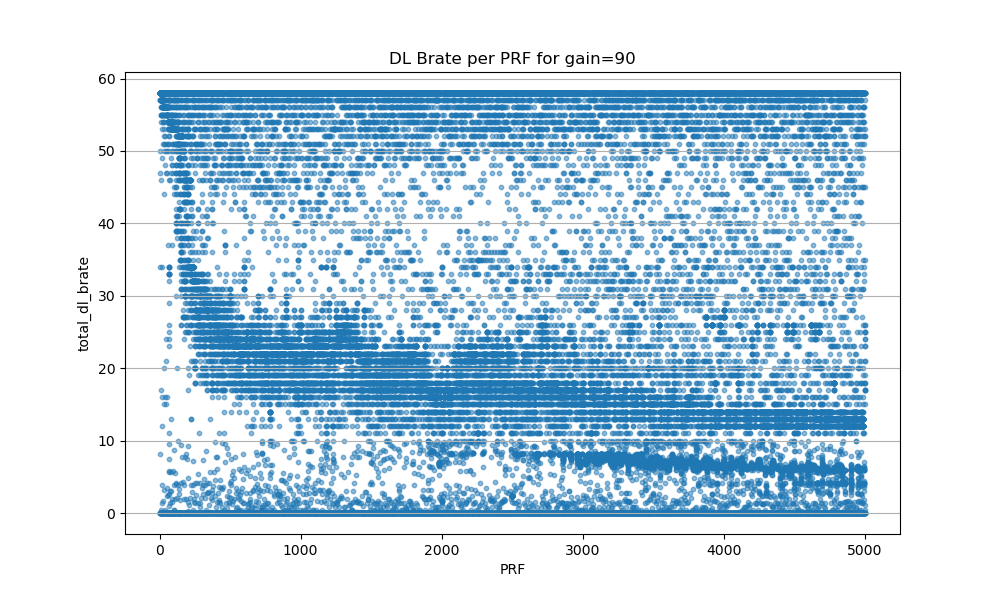
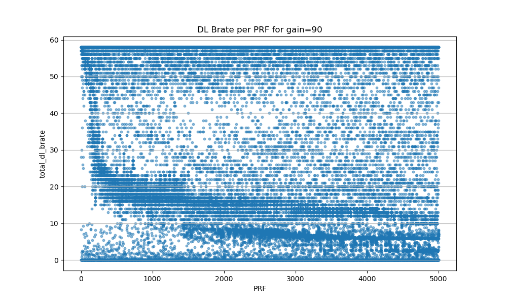

# Overview

This is a repo dedicated to OTA (Over the Air) processing of 5G signals against FM (Frequency Modulated) Pulsed Radar signals. 

# Setup


## Operations
The flow for the data can be see in the OTAexpCTL.py file. And the “runLoop1” is called from main. The flow for each run is as follows:
```
Turn everything off. << or assume they are.
Start the gnb.
Turn air plane mode off on the android phone.
Wait for ue to attach. << validate w/ ping.
Leave ping running in background.
Start iperf server on UE.
Start iperf throughput run . DL test at ~60Mbps.
Start radar for 20s.
Iperf /throughput on the system should be effected.
After 20s stop radar.
Stop iperf test.
Airplane mode ue
Stop gnb.
Collect logs. From /tmp/gnb.
Process logs into respective .csv files.
Increment radar parameters.
Run again.
``` 
This whole thing takes about 30-40s each. And we do about 1-2k times. So about a day or 2. Some are about 800mins.
We don’t save the /tmp/gnb.log files because each run these are about 50-100Mb and at 1-2k runs this is a lot. Last time I left them it was about 120Gb. I need a NAS I guess soon. I have an old computer tower I’ll prob get some 1TB HDDs or something soon, either that or I need a server at stevens to hold things, or at least to back things up for science.

## Logs
Take a look at the processed logs:
```processed_logs_20250804/20250804_100355_ULMeas.csv
processed_logs_20250804/20250804_100355_iperf.csv
processed_logs_20250804/20250804_100355_metrics.csv
processed_logs_20250804/20250804_100355_phy_pucch.csv
processed_logs_20250804/20250804_100355_radar_config.csv
```
 
radar_config.csv is the radar parameters. This is the variable in the experiment. We change either the PRF, the Center frequency, or a few other things to see the influence on the gnb.
 
Iperf.csv this is the data from the iperf3 run that we start. This is set to hit the UE at about 60Mbps which is slightly higher than expected for a 20MHz serving cell. 
 
Metrics.csv these are done ever 1s (1000ms) and are pretty interesting. They show the similar throughput to the iperf test w/ more information about link adapation (MCS) and other things. << pretty “slow” though for logs and information.
 
ULMeas.csv << these are UL Measurement Reports. These are similar to UE UL reports about the DL quality done during a HO. Instead there is no HO (Handover) so I am forcing the UE to report the serving sell statisitics. These can be done as quickly as 120ms. This is the DL RSRP/RSRQ/SINR.
 
Phy_pucch.csv thse are the files that are found from the UE on the PUCCH. These estimate the PUCCH data. This also includes the CSI (Channel State Information) this can be as quick as every 10ms. There are also other metrics collected every 5ms. This is certainly what is filling up the logs.


# Invesitgations
Here are some side investigations that are on going. 

## Finding GAIN interference values. 
We want to find where the GAIN has the most impact. TOO low, and the 5G signal will be unaffected. too high, and we might be oversaturating the whole input and there are no loger any interference values to look at. 

### processed_logs_20250803-1
Here we ran w/ the PRF locked to 3000, and the radar gain set from 30 to 100 in 1 step increments. We ran this experiment 3x . 
```csv
prf,gain,cFreq,PW,T,bw,sampRate
3000,30,3410100000.0,0.0001,20,2000000.0,20000000.0
```


from this file we can see that at about 40 gain there begins to be an impact and after about 85 there is no more impact from increasing the gain. VERY COOL!. 

### processed_logs_20250804
gain from 30-100, stp=1. PRF = 500
```csv
prf,gain,cFreq,PW,T,bw,sampRate
500,30,3410100000.0,0.0001,20,2000000.0,20000000.0
```


### processed_logs_20250805
prf from 5-5000, stp=5, gain=90
here the radar was 5MHz wide while the 0805 prf sweep the radar was 2MHz
```csv
prf,gain,cFreq,PW,T,bw,sampRate
5,90,3410100000.0,0.0001,20,2000000.0,20000000.0
```


### processed_logs_20250806 
prf from 5-5000, stp=5, gain=90
```csv
prf,gain,cFreq,PW,T,bw,sampRate
5,90,3410100000.0,0.0001,20,5000000.0,20000000.0
```
here the radar was 5MHz wide while the Image above (0805 prf sweep) radar was 2MHz


### processed_logs_20250807_prfBlanking
this run we put the radar at the VERY edge of the 20MHz cell. and I wanted to see what would happen if we don't limit and then limit the max PRB allocations. 

```
prf,gain,cFreq,PW,T,bw,sampRate
3000,80,3418100000.0,0.0001,20,2000000.0,20000000.0
```

```
Notes on PRB size
20Mhz = 51prB 
30Khz * 12 * 51 = 18.36MHz
18.36/2 = 9.18
627340 = 3410.1 +/- (9.18)
3400.92 - 3419.28

1 PRB = 12*30KHz = 360KHz
if radar is 2MHz centered at 3418:
    2Mhz / 360KHz = 5.5
    start: 1 
    end: 51 - 5.5 = 45.5 , round to ~45

min_rb_size: 1
    max_rb_size: 51
    start_rb: 0
    end_rb: 51
```


# Experiment Results:
PRF 1000 PW 10uS 
MCS Locked 27 
Estimated Throughput under interference: ~39.07Mbps


PRF 100 PW 10uS
MCS Locked 27 
Estimed Thgouhput under interference: 63.8Mbps


HARQ Logging view of 100Mhz PRF (every 10ms) which is one subframe. Which is every 1 per 0-20 slots. 
In this example the slot .3 is not ack'd therefore "lost" and thus what we see in the nok's also. 


PDCCH interference is shows as an ACK=2 where the UE is saying there was nothing to decode, and is in a state of dTX (Discontinuous transmission). There is nothing for the UE to decode because the PDCCH was not deocded correctly instead of the PDSCH.  


in a x1000 run example with PRF = 100Hz
```
ericforbes@Erics-Laptop 1000x-run-offline %  python3 threshold_analysis.py
Visualization saved as 'threshold_percentage_analysis.png'

Detailed Statistics:
------------------------------------------------------------
Threshold    Count Above     % Above      Count Below 
------------------------------------------------------------
0            11545           100.00       0           
100          1139            9.87         10406       
200          1097            9.50         10448       
300          1055            9.14         10490       
400          1020            8.83         10525       
500          977             8.46         10568       
600          943             8.17         10602       
700          908             7.86         10637       
800          881             7.63         10664       
900          844             7.31         10701       
1000         823             7.13         10722       
1100         790             6.84         10755       
1200         765             6.63         10780       
1300         742             6.43         10803       
1400         723             6.26         10822       
1500         695             6.02         10850       
1600         672             5.82         10873       
1700         634             5.49         10911       
1800         597             5.17         10948       
1900         544             4.71         11001       
2000         130             1.13         11415       
2100         0               0.00         11545       
2200         0               0.00         11545       
2300         0               0.00         11545       
2400         0               0.00         11545       
------------------------------------------------------------

Specific thresholds:
Threshold 1200: 765 rows (6.63%) above
Threshold 1500: 695 rows (6.02%) above
Threshold 1600: 672 rows (5.82%) above
Threshold 1700: 634 rows (5.49%) above
Threshold 1800: 597 rows (5.17%) above
```


PDCCH Interference:


maxThroughput DL/UL


